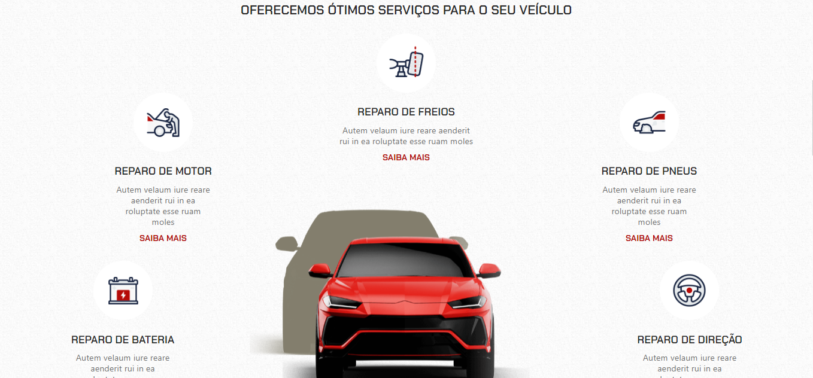
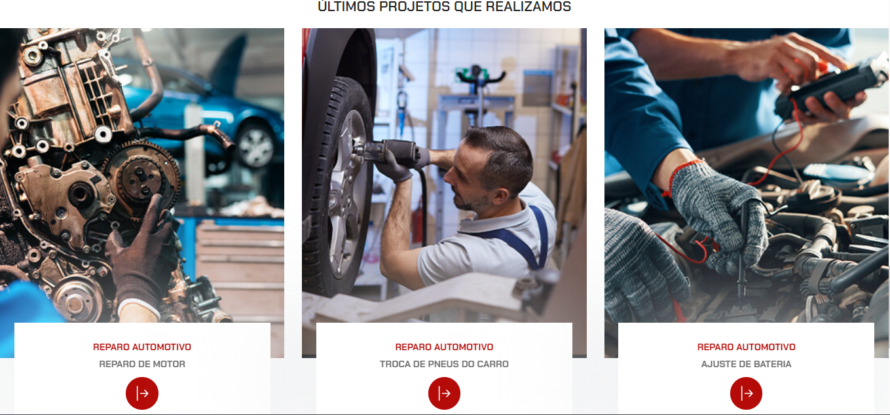

# Template de Mecânica Automotiva

Este template foi desenvolvido para uma oficina mecânica, permitindo que os usuários visualizem os serviços oferecidos e conheçam mais sobre a oficina.

### Informações do Projeto

- **Última atualização:**  
- **Preview:**

### Funcionalidades Principais

1. **Visualização de Serviços:**
   - Lista dos serviços oferecidos pela oficina.
   - Descrição detalhada de cada serviço, incluindo preço e tempo estimado.
   
2. **Conheça a Oficina:**
   - Informações sobre a história da oficina e sua equipe.
   - Testemunhos de clientes satisfeitos.
   
3. **Contato e Localização:**
   - Formulário de contato para solicitação de orçamento.
   - Mapa interativo com a localização da oficina.

### Como Utilizar

Para utilizar este template:

1. Clone o repositório `LucasDiello/site_mecanica`.
2. Personalize as imagens e textos conforme a identidade da sua oficina.
3. Adicione os serviços específicos oferecidos pela sua oficina no arquivo correspondente.
4. Hospede o projeto em um servidor web para que seja acessível aos seus clientes.

### Contribuições

Contribuições são bem-vindas! Sinta-se à vontade para sugerir melhorias através de pull requests.

---

## Acesse
[www.ldmechanics.com](https://ldmechanics.netlify.app/)
